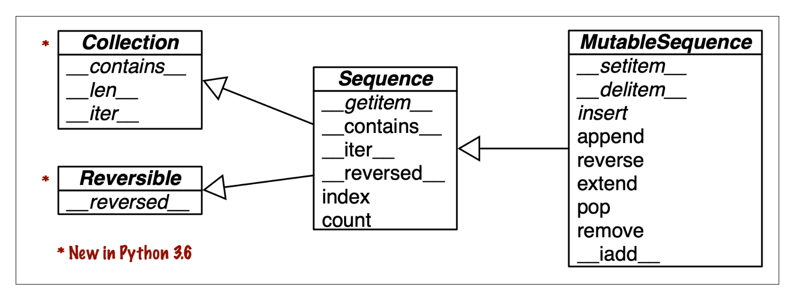

# An Array of Sequences

## Overview of Build-In Sequences
- Container Sequences: Can hold items of different types, including nested containers.
    - Examples: list, tuple, collections.deque.
    - Holds references to the objects inside. 

- Flat Sequences: Can hold items of a single type.
    - Examples: str, bytes, array.array.
    - Holds the actual value within its own memory space. 

- `array.array`vs. `tuple`:
    - `array.array`: A built-in Python module that provides an efficient, memory-friendly array for storing **homogenous** data types. 
        - Store the actual data values within the container, not object references, more lightweight.
    - `tuple` or `list`: A built-in Python object that can contain multiple data types. 
        - Stores memory pointer references of the objects within the container, not the objects themselves. 
        - Requires memeory allocation for the data strucute itself. 

- Mutable Sequences: A data structure that allows elements to be modified after creation. This means you can change, add, remove, or rearrange elements in place without creating a new object.
    - Examples: `list`, `bytearray`, `array.array`, and `collections.deque`.

- Immutable Sequences: A data structure that does not allow elements to be modified after creation.
    - Examples: `tuple`, `str`, and `bytes`.


- Mutable Sequences class inherit all methods from the Immutable Sequences class and include some additional methods unqiue to mutable sequences.

## List Comprehensions and Generator Expressions

- List Comprehension ("listcomps"): An easier approach to creating new lists, containing objects.
    - Example: `codes = [ord(symbol) for symbol in symbols]`

- Generator Comprehension ("genexps"):

- ord(char): returns the Unicode code point (integer representation) of a given character.
- chr(int):  Converts a Unicode point back into a character.

### Local Scope Within Comprehensions and Generator Expressions

- Using the *walrus operator*, `:=`, allows  variables to be assigned within the local scope for the comprehension while remaining accessible outside the loop.
    - Example: `[x := i for i in range(5)]``
    - `x` is assigned the value of i during each iteration and updates continuously, leaving `x` with the last value in the list (4 in this case).

### Listcomps Versus Map and Filter

### Cartesian Products

- Cartesian Products: A way of combining two sets/lists by pairing every element from the first set with every element from the second set.
    - Example: 
    `A = {1, 2}` and `B = {a, b}`
    `A * B = {(1, a), (1, b), (2, a), (2, b)}`
        - The product has `len()` of `len(A) * len(B)`.
    
    
        - Computing the Cartesian product of multiple lists, the order of the for loops determines which list’s elements change first. This affects how the pairs (or tuples) are generated and can be thought of as a filtering or prioritization mechanism. 


### Generator Expressions 

- Generator Expressions (genexps): A concise way to create an iterator without building a full list in memory. It looks like a listcomp but uses parentheses instead of square brackets. 

    - Main purpose of a Generator Expression is to generate values on demand without storing everything in memory. 
    - Unlike *generator functions*, no `yield`is explicitly called, but items are returned one at a time as needed. 
    - The next value will override the current value in memory when called to do so on the next iteration.
    
    

## Tuples Are Not Just Immutable Lists

## Tuples as Records

- Because tuples are immutable, they can serve as *records* where the order and value is important, but without the need for name fields like in function or class calls.
 
    - `%s`is a placeholder variable like in C for `printf`, the `% passport`is tuple unpacking syntax, where the values from the tuple `passport` are inserted into the placeholders.
    - We can't use print('%s/%s', passport) because in Python, this is seen as passing in 2 args into the `print()`.

## Tuples as Immutable Lists

- The immutability of a tuple applies to the references it holds, meaning you cannot modify the tuple by adding, removing, or changing elements. However, tuples store references (or pointers) to objects rather than the actual objects themselves. If an object within a tuple is mutable (like a list or dictionary), and its contents are modified, those changes will be reflected when accessing the object through the tuple, as the tuple still points to the original object.


## Comparing Tuple and List Methods
- A `tuple`supports all of the same methods of a `list`with exception to adding or removing items, as well as the `__reversed__`method, but `reversed(my_tuple)`works without it. 


## Unpacking Sequence and Iterables

1. Parrallel Assignment: Assigning items from an iterable to a tuple of variables.

    
    
    

2. Swapping w/o Temp Variable: Python allows for in-place swapping of variables without the use of a temp. variable. 


3. Unpacking Using the `*` Operator: The `*` operator can be used to capture values in multiple variables within a single line. 
    - Note: `divmod(x, y)` -> returns a `tuple` of a quotient and remainder of x / y. 


4. Functions that Return Multiple Items: Functions can return multiple items as tuples, which then can be unpacked into separate variables. 


## Using `*` to Grab Excess Items

- `*args` is a classic way to grab arbitrary excess arguments when defining function parameters.

- In Python3, this was applied to parallel assignment: 


## Unpacking with `*` in Function Calls and Sequence Literals


## Nested Unpacking


## Pattern Matching with Sequences

- `match` and `case` can be used to match patterns.
    - `str`, `bytes`, `bytearray` are not handled as sequences, but as **atomoic** values, where the value is evaluated on a singular basis. They can still be unpacked with `*`.
    - Compatible w/ Sequence Patterns: `list`, `memoryview`, `array.array`, `tuple`, `range`, `collections.deque`


- Destructuring: A more advanced form of unpacking by allowing for:
    1. Nested Destructuring: `(a, (b, c)) = (1, (2, 3))`
    2. `*` As a *Wildcard* for Extra Values: `a, *b, c = [1, 2, 3, 4, 5]`
    3. Dictionary Destructuring:

    ```py
    person = {"name": "Alex", "age": 25}
   
    name, age = person.values()
    ```
    4. Using `*` To Pass Unpacked Values in Functions:

    ```py
    def greet(name, age):
        print(f"Hi, I'm {name} and I'm {age} years old")

    data = ["Alex", 25]
    greet(*data)
    ```
    5. Ignoring Values w/ `_`: `a, _, c = (1, 2, 3)`


## Pattern Matching Sequences in an Interpreter

- `lis.py`: An interpreter for a subset of the Scheme dialect of the Lisp programming language in 123 lines of beautiful and readable Python code. 

## Slicing

- Slicing: A feature of `list`, `tuple`, `str`, and `sequence` types support slicing operations. 
    - Slices and Ranges exclude the last item.

### Slice Objects

- `s[start:stop:skip]` can be used to specify a *stride*. 


### Assigning to Slices

- 

## Using `+` and `*` With Sequences 

- Usually both operands of + must be of the same sequence type, and neither of them is modified, but a new sequence of that same type is created as result of the concatenation.


### Building Lists of Lists

- Building a list of lists can be done with a list comprehension:


### Augmented Assignment with Sequences

- Augmented Operators: `+=`, `*=`, etc.

- `+=`-> implemented via the `__iadd__` ("in-place addition"), will fall back on to `__add__`. 
    - `__iadd__`: tries to modify the object **in place**.
    - `__add__`: returns a new object.
    
- `*=`-> implemented via the `__imul__` ("in-place multiplication"), will fall back on to `__mul__`. 
    - `__imul__`: tries to modify the object **in place**.
    - `__mul__`: returns a new object.

- Example:


