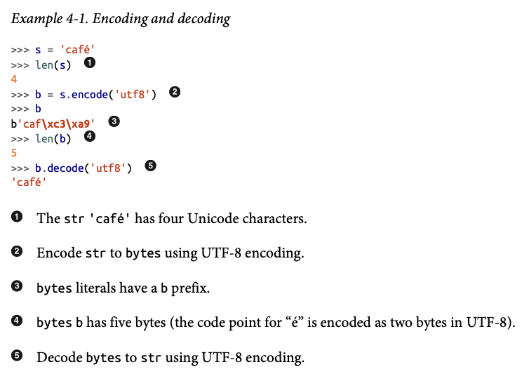
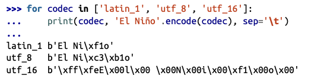
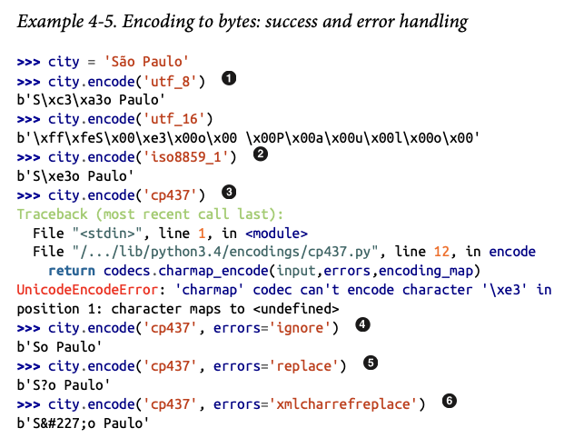
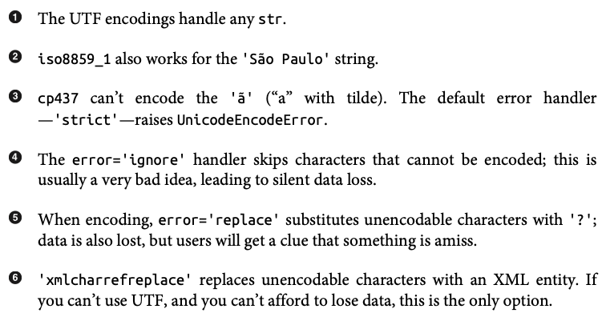
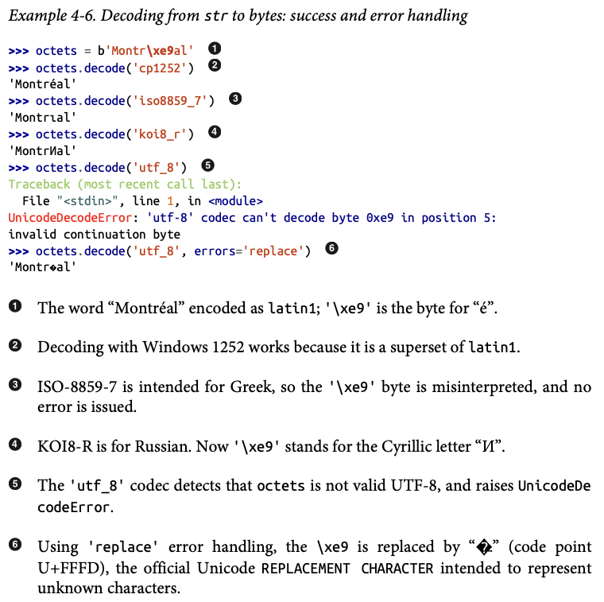
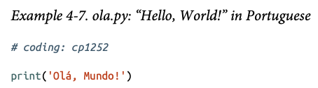

# Unicode Text Versus Bytes

## Character Issues

- Unicode: The abstract standard of characters called code points, a global language dictionary, to define word characters and give them a unique ID.
- UTF-*: Unicode Transformation Format
    - Converts Unicode code points into a stream of bytes readable by a computer.
    - Many different encode/decode formats.

- Encoding: Unicode Code Points --> Bytes
- Decoding: Bytes --> Unicode Code Points

## Byte Essentials

- Two Basic Built-in Binary Sequence Types:
    1. `bytes`: Immutable
    2. `bytearray`: Mutable

## Basic Encoders/Decoders

- Codec: Encoders/decoders
    - Named `utf-#`typically.

1. `latin1` *aka* `iso8859_1`: Important because it is the basis for other encodings, such as cp1252 and Unicode itself (note how the latin1 byte values appear in the cp1252 bytes and even in the code points).

2. `cp1252`: A useful latin1 superset created by Microsoft, adding useful symbols like curly quotes and € (euro); some Windows apps call it “ANSI,” but it was never a real ANSI standard.

3. `cp437`: The original character set of the IBM PC, with box drawing characters. Incompatible with latin1, which appeared later.

4. `gb2312`: Legacy standard to encode the simplified Chinese ideographs used in mainland China; one of several widely deployed multibyte encodings for Asian languages.

5. `utf-8`: The most common 8-bit encoding on the web, by far, as of July 2021.

6. `utf-16le`: One form of the UTF 16-bit encoding scheme; all UTF-16 encodings support code points beyond U+FFFF through escape sequences called “surrogate pairs.”

## Understanding Encode/Decode Problems

- `UnicodeEncodeError`: Error raised when converting `str` to binary sequences.
- `UnicodeDecodeError`: Error raised when reading binary sequences into `str`.
- `SyntaxError`: Error raised when the source encoding is unexpected when loading Python modules.

### Coping with UnicodeEncodeError

- `str.isascii()`: Method added in Python 3.7, returns a `bool` of whether your Unicode text is 100% pure ASCII or not.

### Coping with UnicodeDecodeError

### SyntaxError When Loading Modules with Unexpected Encoding

- `coding` comment: A comment at the top of a *.py* file indicating the codec used.

### How to Discover the Encoding of a Byte Sequence

### BOM: A Useful Gremlin

