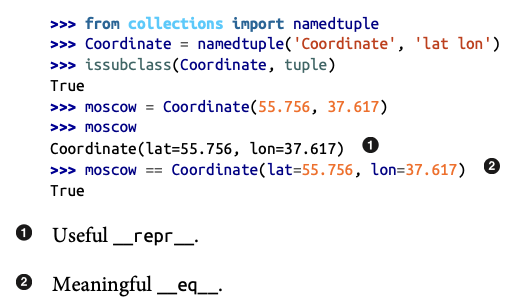
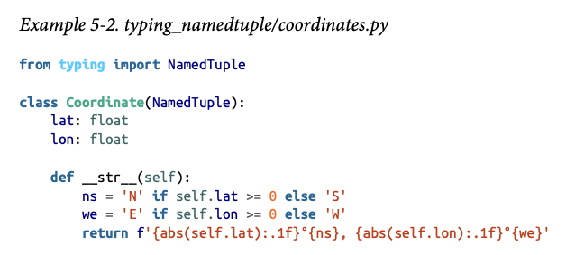
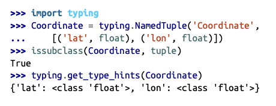
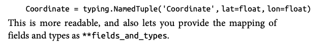

# Chapter 5: Data Class Builders

- Data Class: A simple class that is just a collection of fields, with little or no extra functionality.
    - `dataclasses`

- Code Smell: A coding pattern that may be a symptom of poor object-oriented design. 

## Overciew of Data Class Builders

1. `collections.namedtuple`: A factory function that builds a subclass of tuple with the name and fields you specify. 

2. `typing.NamedTuple`: Provides the same functionality as `collections.namedtuple`, also adding a **type annotation** to each field.
    - Can be used inside `class` statments and inherit from `NamedTuple`.
    

