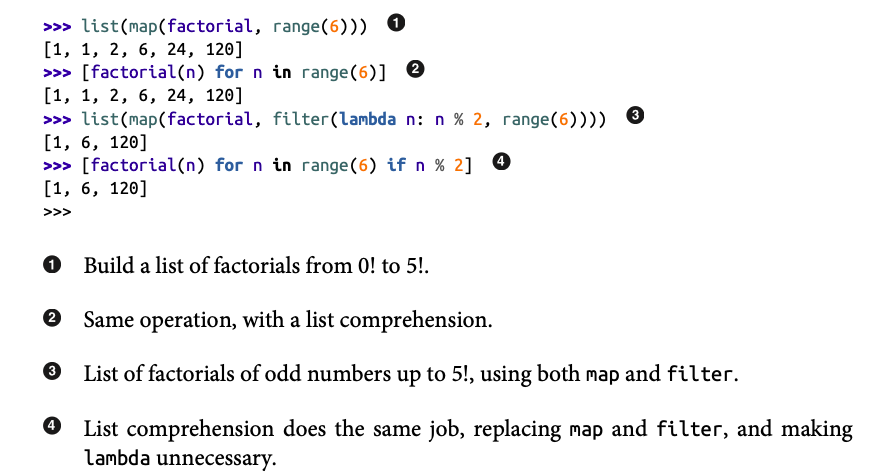
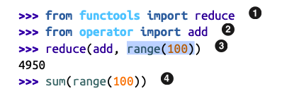

# Functions as First-Class Objects


- Functions in Python are first-class objects. 

- First-Class Object: a program entity that can be:
    1. Created at runtime
    2. Assigned to a variable or element in a data structure
    3. Passed as an argument to a function
    4. Return as the result of a function


- `__doc__`: attribute is used to generate the help text of an object.

- Higher-Order Functions: A function that takes a function as an arguement or returns a function as the result.
    - Example: `map(func, iter)`, `sorted(iter, key=None)`


- `function(*args)` tells Python: take each element of the iterable args and pass it as a separate positional argument.
- `function(**kwargs)` tells Python: take each key–value pair in the dictionary kwargs and pass it as a separate keyword argument.



- `reduce(func, iter)`: Applies `func` to the first to elements in `iter` and repeats with the result and the next element until a final static value is left in the iter.
    - Summation: 
    - Often replaced by built-in functions in newer version of Python, `sum`, `min`, `max`, etc. 

- `all(iter)`: Return `True` if there are no falsy elements in the `iter`; `all([])` returns `True`.
- `any(iter)`: Returns `True` if any element of the `iter` is truthy; `any([])` return `False`.
- NOTE! `all(iter)` and `any(iter)` DO NOT have a `key=None` parameter to define logic cases for the truth/false evaluation...
    - HOWEVER! Apply a **generator comprehension** as the iter and incapsulate the logic within the comprehension.
        - Example:
        ```python
        words = ["hi", "hey", "hello"]
        all(len(w) > 1 for w in words)   # True
        all(word.isalpha() for word in words)  # True
        ````
- left off on page 236

        
        
